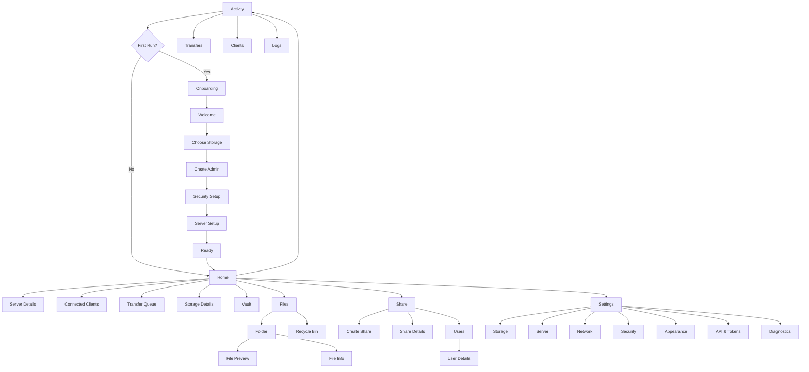

# Android Personal Storage Server — Complete UI/UX Design Specification

> **Document type:** UI/UX Design Handoff  
> **Platform:** Android (minimum SDK 29) + Responsive Web Portal  
> **Primary implementation:** Flutter / Dart with native Android integrations where required  
> **Product name:** TBD — use `{ProductName}` as the temporary product token  
> **Reference visual language:** `MarkDify Wireframes.dc(1).html` — Aurora Glass  
> **Version:** 1.0  
> **Status:** Ready for UI/UX design, prototyping, component-library creation, and engineering handoff

---

## 1. Product Definition

`{ProductName}` turns an Android phone into a secure personal storage server / mini-NAS.

The product must let a user:

- Choose one or more storage locations on the Android device.
- Browse and manage files locally.
- Start and stop a local storage server.
- Access files from another device through a browser.
- Mount storage through WebDAV.
- Optionally enable additional protocols such as FTPS and, in a later phase, SFTP.
- Upload, download, move, copy, rename, delete, restore, share, receive, and organize files/folders.
- Create users and access permissions.
- Generate share links and QR codes.
- Hide files from media indexing.
- Optionally obfuscate selected files.
- Protect sensitive folders using real encryption in Vault mode.
- See connected clients, active transfers, activity history, server health, network information, storage health, and security state.

The product should feel like:

> **“A tiny NAS that happens to live inside your Android phone.”**

It must **not** feel like a complicated enterprise server dashboard.

---

# 2. UX Vision

The core UX objective is:

> **Make advanced storage-server functionality understandable to a normal Android user without removing power-user controls.**

The interface should be:

- Funky
- Friendly
- Technical without being intimidating
- Fast
- Visually distinctive
- Touch-first
- Highly scannable
- Safe around destructive actions
- Honest about server/network states
- Useful without requiring a manual

The interface should reuse the visual personality of the supplied MarkDify Aurora Glass wireframes:

- Handwritten/playful primary display typography
- Clean supporting UI type
- Monospace technical labels
- Thin but visible “ink” borders
- Soft aurora lavender/pink gradients
- Rounded cards
- Very light glass/refraction effects
- Floating mobile navigation with a moving glass lens
- Small server/status chips
- Dense data presented in calm, human layouts
- Minimal shadows
- Strong state communication

---

# 3. UX Principles

## 3.1 Server First, Complexity Second

The Home screen must answer these questions immediately:

1. Is my server running?
2. Where can I access it?
3. How much storage is free?
4. Is it secure?
5. Is anyone connected?
6. Is anything transferring right now?

Do not lead with protocol configuration, IP terminology, certificates, ports, or networking jargon.

---

## 3.2 Never Hide Important Server State

Never use an indefinite spinner as the only feedback.

Prefer explicit states:

- `Server stopped`
- `Starting server…`
- `Server live`
- `No network`
- `Port unavailable`
- `Storage unavailable`
- `Authentication required`
- `2 active transfers`
- `WebDAV unavailable`
- `Certificate warning`

If the system can estimate progress, show it.

If it cannot, explain what is happening.

---

## 3.3 Files Are the Product

The file manager must be as polished as the server experience.

The user should be able to use the app even if they never enable WebDAV or the web portal.

---

## 3.4 Progressive Disclosure

Basic controls should be visible.

Advanced controls should be one layer deeper.

Example:

**Basic server card**
- Start / Stop
- Address
- QR
- Connected devices

**Server Details**
- HTTPS port
- WebDAV
- FTPS
- TLS
- network binding
- certificate
- local hostname
- logs

---

## 3.5 Safe Destructive Actions

Do not immediately permanently delete files by default.

Default behavior:

`Delete → Recycle Bin → Permanent Delete`

Permanent deletion requires confirmation.

Batch destructive actions must show item count.

Example:

> Delete 47 selected items?

If any item cannot be deleted, continue processing the rest and show a result summary.

---

## 3.6 One Failure Must Not Stop a Batch

A failed upload, copy, delete, encryption operation, or share operation must not cancel unrelated items.

Each operation has its own state.

---

# 4. Primary User Types

## 4.1 Casual Storage User

Wants to:

- repurpose an old phone
- send files from laptop to phone
- download files later
- use browser access
- avoid technical configuration

Needs:
- guided onboarding
- QR access
- large Start Server button
- simple file manager
- clear storage overview

---

## 4.2 Power User

Wants:

- WebDAV
- custom ports
- user permissions
- FTPS
- API tokens
- local hostnames
- storage volumes
- audit logs
- encryption
- LAN restrictions

Needs advanced screens without cluttering the basic flow.

---

## 4.3 Home / Family Admin

Wants:

- separate accounts
- per-folder access
- read-only shares
- upload-only folders
- transfer history
- quota controls
- revoking access

---

## 4.4 Developer / Automation User

Wants:

- REST API
- API tokens
- object-like storage
- automation
- logs
- diagnostics
- stable endpoints

---

# 5. Information Architecture

## 5.1 Primary Mobile Navigation

Use a 5-item floating bottom dock:

1. **Home**
2. **Files**
3. **Share**
4. **Activity**
5. **Settings**

### Icons

- Home → home/server glyph
- Files → folder
- Share → link/share
- Activity → arrows/pulse/history
- Settings → sliders/gear

The selected item uses the moving Aurora Glass lens.

---

## 5.2 Secondary Destinations

Secondary screens should not become permanent bottom-navigation tabs.

They are opened contextually:

- Server Details
- Connected Clients
- User Manager
- User Details
- Storage Manager
- Vault
- Recycle Bin
- Transfer Queue
- Web Portal Settings
- Protocol Settings
- API & Tokens
- Network Settings
- Diagnostics
- Logs
- Security
- Appearance
- About

---

## 5.3 Navigation Map



---

# 6. Global Navigation Behaviour

## 6.1 Mobile Dock

Default:

- Height: **74 dp**
- Floating
- Rounded outer shell
- 5 equal navigation items
- 7–8 dp internal padding
- Minimum tap target: 48 × 48 dp

### Selected Lens

The selected item receives a separate glass panel:

- translucent surface
- subtle refraction
- 1.5 px accent rim
- faint highlight
- soft radial illumination
- follows item width
- slides between items using spring motion

Motion target:

- ~420–480 ms spring settle
- no harsh linear motion
- small 4–8 ms haptic tick when selection crosses into another item during drag navigation

### Drag Across Navigation

Allow user to press and drag horizontally across dock items.

During drag:

- lens follows the pointer
- item under pointer previews selection
- commit destination on release
- avoid switching full screen repeatedly while drag is active

---

## 6.2 Compact Dock on Scroll

After approximately 80–96 dp downward content scroll:

- dock height changes from 74 → 58 dp
- labels fade out
- icon size slightly reduces
- glass lens resizes
- dock remains visible

Scrolling upward expands it again.

The dock must never disappear completely.

---

## 6.3 Desktop / Web Navigation

Do **not** use the floating dock on desktop.

Use:

- top header
- product identity at left
- primary navigation after logo
- server status at right
- theme toggle
- user/profile menu

For denser management screens, optional left sidebar may appear at ≥ 1024 px.

---

# 7. Visual Design System

## 7.1 Design Language Name

**Aurora Glass Storage UI**

This is an adaptation of the supplied MarkDify Aurora Glass design language.

---

# 8. Typography

Use typography in three roles.

## 8.1 Personality / Display Font

Preferred:

**Patrick Hand**

Use for:

- major page titles
- friendly headings
- selected primary buttons
- empty-state phrases
- large storage/server statements
- playful short labels

Do not use it for dense technical metadata.

---

## 8.2 Utility / Reading Font

Use Android/system sans:

- Roboto
- system-ui
- SF Pro fallback on web/macOS

Use for:

- filenames
- folder names
- descriptions
- settings
- forms
- long body copy
- tables
- dialogs
- accessibility-critical content

---

## 8.3 Technical / Monospace Font

Use:

- Roboto Mono
- JetBrains Mono
- ui-monospace fallback

Use for:

- IP addresses
- URLs
- ports
- protocol names
- file hashes
- storage identifiers
- server state
- speeds
- timestamps
- logs
- API tokens

---

## 8.4 Type Scale

| Token | Size | Weight / Style | Usage |
|---|---:|---|---|
| Display XL | 34–38 | Patrick Hand | Onboarding hero |
| Display L | 28–32 | Patrick Hand | Home headline |
| Display M | 22–26 | Patrick Hand | Page title |
| Heading | 18–20 | Patrick Hand / 500 | Cards |
| Body L | 16 | Sans 400 | Main body |
| Body M | 14 | Sans 400 | Standard UI |
| Body S | 12–13 | Sans 400 | Supporting text |
| Tech M | 11–12 | Mono 500 | Server info |
| Tech S | 9–10 | Mono 500 | Tags/status |
| Caption | 11 | Sans 400 | Metadata |

Line height must remain generous for dense screens.

---

# 9. Color System

The original reference contains a light visual system. Dark mode below is an intentional product extension.

## 9.1 Brand Gradient

Primary Aurora:

`#8F83D8 → #B58FD0 → #D98FB0`

Soft Aurora:

`#CFC8EF → #EEC9D6`

Use the gradient for:

- primary CTA surfaces
- selected navigation accent
- storage/server hero decoration
- progress accents
- occasional banners

Do not flood entire screens with gradients.

---

## 9.2 Light Theme

```text
Canvas                 #F0EEE9
Surface Primary        #FFFFFF
Surface Secondary      #FAFAFA
Surface Tertiary       #F7F7F5
Ink Primary            #1A1A1A
Ink Secondary          #666666
Ink Tertiary           #8A8A8A
Ink Disabled           #A5A5A5
Border Strong          #1A1A1A
Border Default         #DCDCDC
Border Muted           #E8E8E8
Selection Blue         #2A78D6
Selection Soft         #EEF3FB
Aurora Lavender        #8F83D8
Aurora Mid             #B58FD0
Aurora Pink            #D98FB0
Aurora Soft L          #CFC8EF
Aurora Soft P          #EEC9D6
Success                #3A7A4A
Success Border         #B0CDB4
Warning                #8A6A2A
Warning Border         #DCD0B0
Danger                 #A34A4A
Danger Border          #C98A8A
Danger Surface         #FDF6F6
```

---

## 9.3 Dark Theme

```text
Canvas                 #111113
Surface Primary        #18181C
Surface Secondary      #202026
Surface Tertiary       #26262D
Ink Primary            #F4F1F6
Ink Secondary          #C6C2C9
Ink Tertiary           #928E98
Ink Disabled           #6F6C73
Border Strong          #E8E3EA
Border Default         #3A3941
Border Muted           #2C2B32
Selection Blue         #77AEF4
Selection Soft         #202D3D
Aurora Lavender        #A89BEA
Aurora Mid             #C3A0E0
Aurora Pink            #EEA2C4
Success                #77C68A
Warning                #D8B86A
Danger                 #E88989
Danger Surface         #321F23
```

Dark mode must feel like the same product, not a separate theme.

---

## 9.4 Semantic Rules

Use color + icon + text.

Never represent status using color alone.

Examples:

- `● Server Live`
- `◑ Starting`
- `! Attention`
- `× Failed`
- `✓ Complete`

Amber is semantic only. It is **not** a second brand color.

---

# 10. Borders, Radius, Elevation

## 10.1 Borders

The visual system relies heavily on borders.

Use:

- 1 px subtle dividers
- 1.5 px standard component borders
- 1.5 px strong black/white borders for focal surfaces
- dashed 1.5 px for drop zones / optional areas

Avoid heavy Material shadows.

---

## 10.2 Radius

| Component | Radius |
|---|---:|
| Standard card | 8 dp |
| Large card | 12 dp |
| Bottom sheet | 18 dp top |
| Small chip | 10–14 dp |
| Pill | 18–28 dp |
| Floating dock | 28–32 dp |
| Dialog | 16 dp |
| Thumbnail | 8 dp |

---

## 10.3 Elevation

Use minimal elevation.

Preferred hierarchy:

1. border
2. surface contrast
3. glass effect
4. small shadow only when necessary

---

# 11. Spacing System

Base grid: **4 dp**

Primary tokens:

```text
4   micro
6   compact
8   small
12  standard compact
16  standard
20  large
24  section
32  major section
40  hero
```

Screen horizontal padding:

- compact phone: 14–16 dp
- large phone: 18 dp
- tablet: 24 dp
- desktop: 24–40 px

---

# 12. Iconography

Use a consistent rounded outline icon family.

Recommended visual characteristics:

- 1.8–2.0 px stroke
- rounded line joins
- simple geometry
- no filled icon mixing unless status/selection demands it

File type icons may use subtle category tinting.

Do not make every file type a different saturated color.

---

# 13. Glass Effect

Glass is an accent, not the entire UI.

Use it for:

- navigation lens
- modal handles
- selected compact controls
- server-live hero accent
- QR pairing card highlight

Glass surface:

- 70–88% translucent surface
- light blur where supported
- fine highlight line
- subtle radial light
- 1.5 px rim
- no exaggerated “liquid” distortion that hurts readability

Performance fallback must render as a normal translucent surface if blur is disabled.

---

# 14. Motion System

Motion must communicate state, not delay the user.

## 14.1 Durations

| Interaction | Duration |
|---|---:|
| Tap feedback | 80–120 ms |
| Chip / toggle | 120–180 ms |
| Card expand | 180–240 ms |
| Bottom sheet | 260–340 ms |
| Dock lens spring | 420–480 ms |
| Page transition | 220–300 ms |
| Success pulse | 300–450 ms |

---

## 14.2 Server Start Animation

When server starts:

1. CTA depresses
2. status changes to `Starting…`
3. small aurora ring slowly expands
4. endpoint placeholders appear
5. when ready, state resolves to `Server Live`
6. optional subtle haptic success pulse

Do not use a full-screen loading overlay.

---

## 14.3 Transfer Motion

A transferring row shows:

- thin progress line
- percentage
- live speed
- pause/cancel action where valid

Do not animate the entire row continuously.

---

# 15. Haptics

Use subtle haptics for:

- navigation item crossing
- server started
- selection mode entered
- destructive confirmation
- long press
- drag/drop destination accepted

Haptics must respect system settings.

---

# 16. Responsive Layout

## 16.1 Breakpoints

Suggested logical breakpoints:

```text
Compact: < 600
Medium: 600–839
Expanded: 840–1199
Wide: >= 1200
```

---

## 16.2 Compact Phone

- floating dock
- one-column content
- bottom sheets
- full-screen file browser
- stacked dashboard cards

---

## 16.3 Tablet / Foldable

Use two-pane layouts when useful.

Examples:

**Files**
- left: folder tree / shortcuts
- right: contents

**Settings**
- left: categories
- right: selected settings page

**Activity**
- left: transfer/client list
- right: details

---

## 16.4 Landscape Phone

Prefer:

- NavigationRail or compact side rail
- two-column Home dashboard
- wider file rows
- avoid oversized floating dock consuming vertical space

---

## 16.5 Web Portal/Desktop

Use:

- header navigation
- optional side rail for files/admin
- table/list hybrid layouts
- drag and drop upload
- keyboard shortcuts
- right-click/context menu
- column resizing where appropriate

---

# 17. Global Components

The UI team should create reusable variants for every component below.

---

## 17.1 AppHeader

Variants:

- mobile standard
- mobile selection mode
- tablet
- web/desktop
- contextual detail

Properties:

- title
- back
- server status
- theme
- overflow
- selection count
- search

---

## 17.2 ServerStatusChip

States:

- stopped
- starting
- live
- partial
- offline
- error
- maintenance

Examples:

```text
● Server Live
◑ Starting · 4s
○ Stopped
! Limited
× Error · Fix
```

---

## 17.3 AuroraPrimaryButton

Properties:

- label
- icon
- loading/progress
- enabled
- destructive alternative
- full width / intrinsic width

Never use more than one dominant Aurora CTA inside the same small card.

---

## 17.4 OutlineButton

For:

- secondary action
- Cancel
- Details
- Copy
- Retry
- Advanced

---

## 17.5 DangerButton

Red semantic border/surface.

Used for:

- stop forcefully
- delete permanently
- revoke access
- clear all data
- reset server

---

## 17.6 InfoChip

Examples:

- `HTTPS`
- `WebDAV`
- `LAN only`
- `Encrypted`
- `Read only`
- `3 clients`

---

## 17.7 SettingRow

Contains:

- icon
- title
- description
- optional status
- trailing switch / chevron / value

---

## 17.8 MetricCard

Examples:

- free storage
- active transfers
- connected clients
- upload speed
- download speed
- uptime
- temperature

---

## 17.9 SectionHeader

Includes:

- title
- optional technical eyebrow
- optional action

---

## 17.10 EmptyState

Contains:

- small illustration/icon
- friendly title
- one sentence
- primary optional CTA
- secondary optional link

---

## 17.11 InlineBanner

Types:

- info
- warning
- error
- success

Must never block unrelated content.

---

## 17.12 ConfirmDialog

Variants:

- standard
- destructive
- high-risk security
- overwrite conflict

---

## 17.13 BottomSheet

Variants:

- action sheet
- file actions
- filter
- sort
- create
- server quick controls
- share permissions

---

## 17.14 Toast / Snackbar

Use for brief reversible or completed actions.

Example:

`Moved 12 files · Undo`

---

# 18. Storage Components

## 18.1 StorageMeter

Shows:

- total
- used
- free
- categorized usage when available

Avoid circular gauges as the only representation.

Prefer linear meter + values.

---

## 18.2 StorageLocationCard

Fields:

- display name
- storage type
- path label
- free/total
- online/offline
- read/write status
- default badge
- menu

Types:

- Internal
- SD Card
- USB / OTG
- SAF folder
- encrypted vault

---

## 18.3 StoragePickerRow

Used in Settings and onboarding.

---

# 19. File Manager Component Library

## 19.1 FileRow

Elements:

- selection checkbox when active
- icon/thumbnail
- filename
- optional secondary metadata
- state badges
- overflow

Metadata:
- size
- modified date
- encrypted
- shared
- sync/transfer state

---

## 19.2 FolderRow

Elements:

- folder icon
- folder name
- item count optional
- modified date
- permission state
- overflow

---

## 19.3 GridTile

Use for image-heavy browsing.

Contains:

- thumbnail/icon
- filename
- optional badges
- selection overlay

---

## 19.4 Breadcrumb

Desktop/tablet:
`Storage / Photos / 2026 / September`

Mobile:
- back control
- current folder
- optional breadcrumb bottom sheet

---

## 19.5 FileActionBar

When items selected:

- count
- Share
- Move
- Copy
- Delete
- More

For narrow screens:
keep only highest-priority actions visible.

---

## 19.6 FileContextMenu

Actions:

- Open
- Download
- Share
- Copy
- Move
- Rename
- Duplicate
- Add to favorites
- Hide from gallery
- Encrypt / Move to Vault
- Details
- Delete

Show only relevant actions.

---

## 19.7 TransferRow

Fields:

- filename
- direction
- destination/source
- progress
- size
- speed
- ETA
- pause
- cancel
- error retry

---

## 19.8 ConflictDialog

When same filename exists:

Options:

- Replace
- Keep both
- Skip

Checkbox:

`Apply to all conflicts`

Show existing/new size and modified date where available.

---

# 20. Sharing Components

## 20.1 ShareCard

Shows:

- resource/folder
- share status
- expiry
- permission
- link status
- recent activity
- menu

---

## 20.2 QRCard

Contains:

- QR code
- short address
- Copy
- Share
- Regenerate
- expiry

---

## 20.3 PermissionSelector

Choices:

- Read only
- Read + download
- Upload only
- Read + write
- Full control

Use clear human descriptions.

---

## 20.4 UserAvatar

Simple generated avatar from initials.

No requirement for account photos.

---

# 21. Security Components

## 21.1 SecurityScoreCard

Do not present a fake percentage score.

Use a checklist:

```text
✓ HTTPS enabled
✓ Admin password set
✓ Guest access disabled
! Certificate is self-signed
○ Vault not configured
```

---

## 21.2 VaultBadge

`Encrypted`

Must use icon + text.

---

## 21.3 CredentialField

Features:

- show/hide
- copy where appropriate
- strength feedback
- generated-password option

---

# 22. Screen Inventory

The design team should produce final frames and interactive states for all screens below.

---

# 23. Splash Screen

## Purpose

Fast brand transition while app initializes.

## Elements

- `{ProductName}` logo
- soft aurora blob
- no progress percentage unless initialization genuinely has measurable steps

If initialization takes longer than ~700 ms, show small status:

`Preparing storage…`

---

# 24. Welcome / Onboarding 01

## Hero

**Turn this phone into your personal storage server.**

Supporting text:

> Store files here, access them from your browser, or mount the phone as network storage.

Primary:
`Set up this phone`

Secondary:
`Learn how it works`

Visual:

- stylized phone
- laptop
- folder
- connection line
- no photorealistic stock imagery

---

# 25. Onboarding 02 — Choose Storage

Title:

**Where should your files live?**

Options:

- Internal storage
- SD card
- USB storage
- Choose a folder

Each option is a `StorageLocationCard`.

Show:
- capacity
- free space
- availability

Primary:
`Continue`

Secondary:
`I’ll configure this later`

If storage is required for server operation, explain the limitation.

---

# 26. Onboarding 03 — Admin Account

Title:

**Create the owner account**

Fields:

- username
- password
- confirm password

Options:

- generate strong password
- enable biometric app unlock

Explain:

> This account controls server settings and full storage access.

---

# 27. Onboarding 04 — Server Access

Title:

**How will you access this phone?**

Default enabled:

- Browser access / HTTPS
- WebDAV

Optional:
- FTPS

Advanced later:
- SFTP

Show a simple recommendation:

`Recommended setup`

Do not expose every port yet.

---

# 28. Onboarding 05 — Security

Settings:

- LAN-only access — default ON
- Require login — fixed ON for first setup
- HTTPS — default ON
- Hide server on mobile data — default ON
- Auto-lock app after inactivity

Show security explanation in plain language.

---

# 29. Onboarding 06 — Ready

Title:

**Your storage server is ready.**

Card:

```text
{ProductName}
192.168.x.x:8443

Browser     Ready
WebDAV      Ready
Storage     82.4 GB free
```

Actions:

- `Start server`
- `Show QR`
- `Go to Home`

---

# 30. Home — Server Stopped

This is the default control center.

## Header

- product name/logo
- server chip: `○ Stopped`
- theme

## Hero Card

Eyebrow:
`PERSONAL STORAGE SERVER`

Headline:
**Your phone. Your files. Your server.**

Storage summary.

Primary:
`Start server`

Secondary:
`Server settings`

## Quick Cards

- Storage
- Security
- WebDAV
- Vault

## Recent Files

3–5 recent items.

## Recent Activity

Short summary.

---

# 31. Home — Starting Server

Do not navigate away.

Hero changes to:

`Starting your server…`

Step labels where possible:

- Checking storage
- Checking network
- Starting HTTPS
- Starting WebDAV
- Ready

Queued interactions remain available.

Stop action:
`Cancel startup`

---

# 32. Home — Server Live

## Hero

Status:
`● SERVER LIVE`

Primary address:

`https://vaultbox.local:8443`

Fallback IP:

`192.168.1.41:8443`

Actions:

- Copy
- QR
- Open portal
- Stop server

## Protocol Chips

```text
HTTPS ●
WebDAV ●
FTPS ○
```

## Live Metrics

- connected clients
- upload
- download
- uptime

## Storage

Free / total.

## Active Transfers

Show up to 3, then:
`View all`

## Connected Clients

Show up to 3.

---

# 33. Home — Limited Server

Example:

HTTPS works but WebDAV failed.

Show:

`! Server running with limited services`

Individual protocol status.

CTA:
`Fix WebDAV`

Do not shut down the working web server.

---

# 34. Home — No Network

Banner:

**No usable local network**

Body:
> Connect to Wi-Fi, Ethernet, or enable hotspot mode before starting network access.

Actions:

- Open network settings
- Hotspot instructions
- Retry

Local file manager remains usable.

---

# 35. Server Details

Sections:

## Status

- running / stopped
- uptime
- network
- IP
- hostname

## Endpoints

- Web portal URL
- WebDAV URL
- FTPS host/port if enabled
- API base URL

Each row:
- Copy
- QR where useful

## Protocols

Toggle/enter protocol details.

## Security

- TLS
- auth
- LAN-only
- active certificate

## Advanced

- port binding
- network interface
- custom hostname
- server logs

---

# 36. Connected Clients

List rows:

- device icon
- client name / fallback IP
- user
- access type
- protocol
- last activity
- upload/download
- session duration

Swipe or menu:
- Disconnect
- Block
- View activity

---

# 37. Client Details

Fields:

- IP
- hostname if resolved
- first seen
- last seen
- user
- protocol
- session
- current transfer
- total transferred
- permissions

Actions:

- Disconnect session
- Block client
- Copy IP

---

# 38. Files — Root

## Header

Title:
`Files`

Actions:
- Search
- View mode
- More

## Storage Shortcut Area

Horizontal cards:

- Internal
- SD card
- USB
- Vault
- Recycle Bin

## Favorites

Pinned folders.

## Files / Folders

List or grid.

Floating action:
`+`

Create sheet:
- New folder
- Add files
- Upload from device
- Create text file (optional phase)
- Create upload request

---

# 39. Files — Folder View

Header:

- back
- folder name
- search
- menu

Optional breadcrumb.

Toolbar:

- sort
- filter
- view mode

File area.

Sticky transfer indicator at bottom if operations active.

---

# 40. File Multi-Select

Long press enters selection mode.

Header:

`12 selected`

Actions:

- Share
- Move
- Copy
- Delete
- More

Selection must survive small scrolling/navigation within the same folder unless user exits mode.

---

# 41. Search Files

Search field receives immediate focus.

Scopes:

- Current folder
- Current storage
- All storage

Filters:

- file type
- size
- modified date
- encrypted
- shared

Recent searches optional.

Search result row must show parent path.

---

# 42. Sort & Filter Sheet

Sort:

- Name A–Z
- Name Z–A
- Newest
- Oldest
- Largest
- Smallest
- Type

Filter:

- Folders
- Images
- Video
- Audio
- Documents
- Archives
- Other
- Encrypted
- Shared

Buttons:
- Reset
- Apply

---

# 43. File Preview

Support UI shells for:

- image
- video
- audio
- PDF/document
- text
- markdown
- unknown file

Top controls:

- Back
- Name
- Share
- More

Bottom info area:

- size
- modified
- path

If preview unsupported:

`Preview unavailable`

Actions:
- Download/Open externally
- Share
- Details

---

# 44. File Details

Sections:

## General
- name
- type
- size
- location
- created
- modified

## Security
- hidden
- encrypted
- shared

## Integrity
- SHA-256
- verify button

## Access
- users/groups with access

Actions:
- Rename
- Move
- Share
- Hide
- Encrypt
- Delete

---

# 45. New Folder Dialog

Field:
`Folder name`

Buttons:
- Cancel
- Create

Validate:
- forbidden characters
- duplicate name
- empty
- overly long name

---

# 46. Move / Copy Destination Picker

Top:
`Move 12 items`

Tree/list of destinations.

Show:
- storage roots
- folder path
- create folder action

Bottom sticky CTA:
`Move here`

Prevent choosing invalid recursive destination.

---

# 47. File Operation Queue

Tabs:

- Active
- Completed
- Failed

Each operation card:

- operation type
- source
- destination
- file count
- progress
- speed
- ETA
- pause
- cancel

Batch result:

`47 completed · 2 failed`

Action:
`Review failures`

---

# 48. Recycle Bin

Header:
`Recycle Bin`

Info:
`Items are permanently deleted after 30 days.`

Actions:

- Restore
- Delete permanently
- Empty bin

Each row includes deletion date and original path.

---

# 49. Share — Main

Sections:

## Quick Share

CTA:
`Create share`

## Active Links

Cards:
- folder/file
- permission
- expiry
- views/downloads
- status

## Users

Summary:
`4 users`

Action:
`Manage users`

## Upload Requests

Optional:
- active drop boxes
- expired requests

---

# 50. Create Share — Step 1

Choose:

- File
- Folder

Allow multi-select only if implementation supports a logical share collection.

---

# 51. Create Share — Step 2 Permissions

Options:

- View only
- Download
- Upload only
- Read + write

Advanced:

- allow delete
- allow rename
- allow folder creation

---

# 52. Create Share — Step 3 Security

Options:

- require password
- expire
- maximum downloads
- restrict to LAN
- authenticated users only

Primary:
`Create link`

---

# 53. Share Created

Hero:

**Share ready**

QR code.

URL.

Buttons:

- Copy link
- Share
- Show QR
- Manage access

Display:
- expiry
- permission
- password requirement

---

# 54. Share Details

Metrics:

- created
- expires
- downloads
- last access

Controls:

- enabled
- permission
- password
- expiry
- max downloads

Danger:
`Revoke share`

Activity list underneath.

---

# 55. User Manager

Header:
`Users`

Admin account pinned.

Rows show:

- name
- role
- status
- last active
- quota optional

CTA:
`Add user`

---

# 56. Add User

Fields:

- username
- password
- role

Roles:

- Administrator
- Read + write
- Read only
- Upload only
- Custom

Storage access section:

- All storage
- Selected folders

Quota optional.

---

# 57. User Details

Sections:

- account
- role
- folder access
- protocols allowed
- active sessions
- last login
- storage quota

Actions:

- reset password
- disable user
- revoke sessions
- delete user

---

# 58. Activity — Main

Top segmented tabs:

- Transfers
- Clients
- Events

Summary cards:

- active
- today uploaded
- today downloaded
- connected clients

---

# 59. Activity — Transfers

Groups:

- Active
- Waiting
- Completed
- Failed

Filter by:
- upload
- download
- local operation
- user
- protocol

---

# 60. Activity — Events

Chronological audit list.

Examples:

```text
23:14  Vishal logged in · WebDAV
23:12  Server started
23:10  share /Photos created
23:03  14 files uploaded · browser
22:52  failed login · 192.168.1.22
```

Use monospace timestamps.

Security-relevant events get semantic markers.

---

# 61. Logs

Power-user screen.

Features:

- search
- filter level
- export
- copy
- pause auto-scroll

Levels:

- Debug
- Info
- Warning
- Error

Default user-facing screen should not show raw logs unless user opens this section.

---

# 62. Vault — Locked

Hero:

**Vault locked**

Description:
> Encrypted files stay protected until you unlock them.

Actions:

- Unlock
- Biometric unlock if enabled

Never preview filenames if user has enabled private metadata mode.

---

# 63. Vault — Home

Storage:
- vault used/free

Sections:

- folders
- recent encrypted files

CTA:
`Add to Vault`

Badge:
`AES-256-GCM` only if implementation actually uses it.

---

# 64. Move to Vault Flow

Explain:

- file will be encrypted
- original plaintext will be removed after verified encryption
- operation may take time

Progress screen must show item-level status.

If interrupted:
show recovery status, never silently lose source.

---

# 65. Hide / Privacy Sheet

Options:

### Hide from gallery
Creates `.nomedia` behaviour where applicable.

### Camouflage
Reversible obfuscation.

### Move to Vault
Real encryption.

Each option needs a short explanation.

Do not label hiding/obfuscation as encryption.

---

# 66. Settings — Main

Groups:

## Storage
- Storage locations
- Default folder
- Recycle Bin
- Storage health

## Server
- Web portal
- WebDAV
- FTPS
- Advanced protocols
- Auto start

## Network
- Interface
- Local hostname
- LAN restrictions
- Hotspot

## Security
- Authentication
- TLS
- Vault
- App lock
- Sessions

## Sharing
- defaults
- expiry
- upload requests

## API
- API server
- tokens

## App
- Appearance
- Notifications
- Language
- Accessibility

## System
- Diagnostics
- Logs
- Backup settings
- About

---

# 67. Settings — Storage Locations

Cards for every configured storage source.

Actions:

- Set default
- Rename display name
- Test read/write
- Remove
- Re-authorize

CTA:
`Add storage location`

---

# 68. Settings — Server

Global control:
`Server enabled`

Subsections:

- Web portal
- WebDAV
- FTPS
- SFTP (future)
- REST API

Each protocol row:

- toggle
- port
- current state
- details

Advanced:
- bind interface
- connection limit
- transfer limit
- idle timeout

---

# 69. Settings — Web Portal

Settings:

- enabled
- port
- HTTPS
- title/logo optional
- login required
- upload allowed
- theme default
- session timeout

Preview action:
`Open web portal`

---

# 70. Settings — WebDAV

Fields:

- enabled
- endpoint
- port inherited/custom
- authentication required
- path prefix
- read-only emergency mode

Action:
`Copy setup instructions`

---

# 71. Settings — FTPS

Clearly label as optional compatibility mode.

Fields:

- enabled
- explicit/implicit mode if supported
- port
- passive port range if needed
- certificate

Warning:
Do not encourage insecure FTP.

If plain FTP exists:
place it under `Advanced → Insecure legacy mode`.

---

# 72. Settings — Network

Sections:

## Active Interface
- Wi-Fi
- Ethernet
- Hotspot

## Address
- local IP
- hostname

## Restrictions
- LAN only
- stop on mobile data
- trusted networks
- allowed subnet optional

---

# 73. Settings — Security

Sections:

- Admin account
- App lock
- Authentication
- TLS
- Active sessions
- Failed-login protection
- Vault
- Security events

CTA:
`Review security`

---

# 74. Settings — TLS / Certificate

Show:

- certificate type
- fingerprint
- issued
- expiry
- self-signed status

Actions:

- regenerate
- import
- export public certificate

Do not expose private key export by default.

---

# 75. Settings — API & Tokens

API status.

Token cards:

- name
- scope
- created
- last used
- expiry

CTA:
`Create token`

Token value shown only once after creation.

---

# 76. Create API Token

Fields:

- name
- expiry

Scopes:

- files.read
- files.write
- shares.read
- shares.write
- server.read
- server.manage

Review screen before creation.

---

# 77. Settings — Appearance

Theme:

- System
- Light
- Dark

Additional:

- Reduce transparency
- Reduce motion
- Compact file rows
- Larger touch targets
- Show file thumbnails
- Handwritten headings on/off accessibility option

---

# 78. Diagnostics

Cards:

## Storage
- read
- write
- free space
- latency

## Network
- interface
- local IP
- port checks
- mDNS

## Server
- HTTPS
- WebDAV
- FTPS
- API

## Android
- background restrictions
- battery optimization
- permissions
- notification permission
- foreground service state

Action:
`Run diagnostics`

---

# 79. Diagnostic Results

Use a checklist.

Example:

```text
✓ Storage readable
✓ Storage writable
✓ Wi-Fi connected
✓ HTTPS listening :8443
✓ WebDAV responding
! Battery optimization may stop the server
× Port 2121 unavailable
```

Every failed item gets:
`Fix`

---

# 80. About

- logo
- version
- build
- open-source licenses
- privacy
- GitHub if applicable
- documentation
- export diagnostics

---

# 81. Web Portal — Login

Centered card.

Fields:

- username
- password

Optional:
- remember this device

Server identity visible.

Show HTTPS security state.

Do not expose raw server diagnostics to unauthenticated visitors.

---

# 82. Web Portal — Files

Desktop layout:

```text
Header
┌──────────────┬─────────────────────────────────────────┐
│ Folder Rail  │ Toolbar                                 │
│              ├─────────────────────────────────────────┤
│ Storage      │ File / Folder List                      │
│ Favorites    │                                         │
│ Shares       │                                         │
│ Recycle Bin  │                                         │
└──────────────┴─────────────────────────────────────────┘
```

Toolbar:

- breadcrumb
- upload
- new folder
- search
- sort
- view

Support drag/drop.

---

# 83. Web Portal — Mobile Browser

Responsive one-column file manager.

Do not simply scale the desktop table.

Use:
- compact header
- bottom action sheet
- mobile list rows
- multi-select toolbar

---

# 84. Public Share Page

Unauthenticated shared-link view.

Brand-light experience.

Show only:

- share title
- shared content
- permission
- expiry if useful
- download/upload CTA

Do not expose server navigation.

---

# 85. Upload Request Page

Large drop zone.

Title:
**Send files to {owner/share name}**

Shows:
- allowed file size
- expiry
- accepted types if restricted

After upload:
- per-file result
- completion confirmation

Do not reveal folder contents for upload-only shares.

---

# 86. Global UI States

Every major screen must have designs for:

- initial loading
- empty
- success
- partial success
- warning
- error
- offline
- permission denied
- storage disconnected
- server stopped
- server starting
- server running
- server limited
- operation in progress
- background operation
- session expired

---

# 87. File State Matrix

| State | Visual treatment | Action |
|---|---|---|
| Normal | standard row | open |
| Selected | tinted border/background | toolbar actions |
| Uploading | progress bar | pause/cancel |
| Downloading | progress bar | pause/cancel |
| Failed | danger border | retry |
| Shared | share badge | manage |
| Hidden | hidden-eye badge | unhide |
| Encrypted | lock badge | unlock/details |
| Unavailable | muted | locate/reconnect |
| Deleted | Recycle Bin context | restore |

---

# 88. Server State Matrix

| State | Chip | Hero action |
|---|---|---|
| Stopped | `○ Stopped` | Start |
| Starting | `◑ Starting` | Cancel |
| Live | `● Server Live` | Stop |
| Limited | `! Limited` | Fix |
| Offline | `× No Network` | Network settings |
| Error | `× Server Error` | Troubleshoot |
| Maintenance | `● Maintenance` | Resume |

---

# 89. Permission UX

Permissions must be contextual.

Do not ask for every permission on first launch.

Examples:

Storage:
ask when choosing storage.

Notifications:
ask before server foreground notification is required.

Biometric:
ask when enabling biometric unlock.

Network-related Android settings:
explain why before deep-linking.

Every permission explanation should contain:

1. what the app needs
2. why
3. what happens if user declines

---

# 90. Empty States

## Files

**Nothing here yet.**

`Add files`

## Shares

**No links are floating around yet.**

`Create your first share`

## Activity

**Quiet server.**

`Transfers and client activity will appear here.`

## Users

**Only you have access.**

`Add another user`

## Vault

**Your encrypted space is empty.**

`Add to Vault`

---

# 91. Error Writing Style

Good:

> We can’t write to this storage location anymore.

> Reconnect the SD card or choose another folder.

Bad:

> java.io.IOException: EPERM

Technical information may appear under:
`Technical details`

---

# 92. Microcopy Tone

Tone should be:

- confident
- short
- friendly
- technically accurate
- never childish

Examples:

**Server stopped**
> Your files stay local. Start the server when you want other devices to connect.

**Server live**
> Ready on your local network.

**No network**
> The server needs Wi-Fi, hotspot, or Ethernet before another device can reach it.

**Vault**
> Hiding changes visibility. Vault encrypts the file itself.

---

# 93. Accessibility

Minimum requirements:

- WCAG AA equivalent contrast
- 48 dp Android tap targets
- visible focus indicators on web
- screen-reader labels
- keyboard navigation on web
- no status by color alone
- Dynamic Type / font scaling
- layout must survive 200% text scaling where feasible
- Reduced Motion
- Reduce Transparency
- meaningful semantic order
- minimum 4.5:1 body text contrast

Patrick Hand must not be required for comprehension.

If readability setting is enabled, replace decorative handwritten typography with system sans.

---

# 94. Keyboard & Desktop Shortcuts

Web portal / tablet keyboard:

```text
Ctrl/Cmd + A    Select all
Ctrl/Cmd + C    Copy
Ctrl/Cmd + X    Cut
Ctrl/Cmd + V    Paste
Delete          Move to recycle bin
Shift + Delete  Permanent delete confirmation
Ctrl/Cmd + F    Search
Ctrl/Cmd + U    Upload
Ctrl/Cmd + N    New folder
Esc             Exit selection / close modal
Enter           Open selected item
```

---

# 95. Gesture Rules

Mobile:

- tap → open
- long press → enter selection
- swipe actions only for low-risk actions
- destructive swipe must require secondary confirmation or Undo
- pull to refresh only where refresh makes sense
- drag files only on tablet/desktop if reliable

Do not overload gestures with hidden essential functionality.

---

# 96. Performance UX Rules

Design must assume folders containing thousands of items.

Therefore:

- skeleton only for first load
- incremental list population
- thumbnails lazy-load
- stable row height
- do not shift layout as metadata arrives
- do not calculate every file hash automatically
- do not show indefinite full-screen loading during copy/move
- background operations persist in Activity
- file list remains interactive while transfers run

---

# 97. Loading Skeletons

Skeletons should imitate actual structure.

Do not use random grey blocks.

Examples:

File row skeleton:
- icon
- filename line
- metadata line

Metric skeleton:
- label
- value

---

# 98. Notifications

Notification categories:

- server running
- transfer complete
- transfer failed
- storage disconnected
- login/security event
- share used
- backup completed

Persistent server notification should include:

- server status
- local address
- active transfer count
- Stop action
- Open action

---

# 99. Android System Integration UX

Provide dedicated UI states for:

- Battery optimization warning
- Background restriction warning
- Storage permission revoked
- SD card removed
- USB storage detached
- Wi-Fi disconnected
- Hotspot stopped
- Notification permission denied

Each state must contain a direct fix action where Android allows it.

---

# 100. Landscape / Tablet Master-Detail

## Files

Left:
- storage
- folders
- favorites

Right:
- selected folder contents

Optional preview pane at very wide width.

## Settings

Left:
- category rail

Right:
- details

## Activity

Left:
- list

Right:
- selected event/client/transfer

---

# 101. Design Components Naming Convention

Recommended Figma naming:

```text
Navigation/
  Dock/
    Default
    Compact
    Dragging
  Header/
    Mobile
    Tablet
    Web

Buttons/
  PrimaryAurora
  Secondary
  Danger
  Text
  Icon

Status/
  ServerChip
  ProtocolChip
  TransferState
  SecurityState

Files/
  FileRow
  FolderRow
  GridTile
  Breadcrumb
  SelectionBar
  TransferRow

Storage/
  StorageCard
  StorageMeter
  StoragePicker

Sharing/
  ShareCard
  QRCard
  PermissionSelector
  UserRow

Security/
  VaultBadge
  SecurityChecklist
  CredentialField

Feedback/
  Banner
  Snackbar
  EmptyState
  ErrorState
  Skeleton

Sheets/
  ActionSheet
  SortFilter
  Create
  ServerQuickActions
```

---

# 102. Figma File Structure

Recommended pages:

```text
00 — Cover & Principles
01 — Foundations
02 — Components
03 — Navigation
04 — Onboarding
05 — Home / Server
06 — Files
07 — Share & Users
08 — Activity
09 — Vault
10 — Settings
11 — Diagnostics
12 — Web Portal
13 — Responsive
14 — States & Errors
15 — Prototypes
16 — Developer Handoff
```

---

# 103. Component Variant Requirements

Every interactive component should include:

- default
- hover web
- pressed
- focus
- selected
- disabled
- loading
- error where relevant
- dark
- light

No component should be handed to engineering only as a single static screenshot.

---

# 104. Design Tokens for Engineering

Design team should provide a token export equivalent to:

```yaml
color:
  canvas:
  surface:
  surface_alt:
  ink:
  ink_secondary:
  border:
  border_strong:
  accent_blue:
  aurora_lavender:
  aurora_mid:
  aurora_pink:
  success:
  warning:
  danger:

radius:
  xs: 6
  sm: 8
  md: 12
  lg: 16
  pill: 999

space:
  1: 4
  2: 8
  3: 12
  4: 16
  5: 20
  6: 24
  8: 32
  10: 40

motion:
  fast: 120
  standard: 220
  sheet: 300
  lens: 470
```

---

# 105. Flutter Component Mapping

Suggested high-level widget naming:

```text
AuroraAppShell
AuroraHeader
AuroraNavDock
AuroraNavLens
AuroraCard
AuroraPrimaryButton
AuroraStatusChip
ServerHeroCard
ServerEndpointCard
StorageUsageCard
StorageLocationCard
FileBrowserView
FileListRow
FolderListRow
FileGridTile
FileSelectionBar
FileOperationSheet
TransferProgressRow
ConnectedClientRow
ShareLinkCard
ShareQrCard
UserPermissionCard
VaultStatusCard
SecurityChecklistCard
SettingSection
SettingTile
InlineStatusBanner
AuroraBottomSheet
AuroraDialog
EmptyStateView
DiagnosticResultRow
```

This naming is illustrative; engineering can adapt it to its architecture.

---

# 106. Home Layout Priority

Do not over-dashboard Home.

Priority order:

1. Server state
2. Access address / QR
3. Storage
4. Transfers
5. Clients
6. Security warning
7. Recent files/activity

Anything else belongs deeper.

---

# 107. File Manager Priority

The visual hierarchy must be:

1. current location
2. file/folder content
3. active selection
4. file operations
5. filter/sort
6. metadata

Do not let decorative server visuals overpower the file list.

---

# 108. WebDAV Setup Helper

Inside Server Details, include:

`Connect another device`

Choose platform:

- Windows
- macOS
- Android
- Linux
- Other

The helper shows:

- endpoint
- username
- password guidance
- platform-specific instructions

Allow:
`Copy endpoint`

---

# 109. QR Pairing Flow

Home → QR

Sheet/page shows:

- QR
- server name
- local address
- network
- expiration if temporary pairing token

Modes:

1. Login page QR
2. Temporary pairing QR
3. Share QR

These must visually differ and state what scanning will do.

---

# 110. Security Warning Hierarchy

Severity:

## Critical
Immediate data/security risk.

Red.

## Warning
Configuration may reduce reliability/security.

Muted amber.

## Info
Neutral guidance.

Blue.

Never use scary warnings merely because the user enabled an advanced feature intentionally.

---

# 111. Storage Disconnected Flow

If SD/USB storage disappears:

1. server remains running if other roots are available
2. unavailable root becomes muted
3. active operations fail individually
4. Home receives warning
5. affected shares show `Storage unavailable`

CTA:
`Reconnect storage`

---

# 112. Session Expired Flow

Web portal:

Modal:
**Session expired**

`Sign in again`

Preserve:
- navigation destination
- non-sensitive UI state where possible

Never silently redirect and lose an in-progress upload without explanation.

---

# 113. Upload Experience

Browser/mobile:

- drag/drop desktop
- choose files
- multiple selection
- queued upload list
- progress
- retry failed
- cancel individual
- cancel all
- minimize upload panel

Uploads continue while user browses other folders if technically supported.

---

# 114. Download Experience

For multiple downloads:

- prepare ZIP if selected by user
- clearly communicate archive preparation
- show estimated size if available

Do not silently compress large selections without explaining it.

---

# 115. Notifications Inside App

Notification center is optional.

If implemented, it should be accessible through Activity, not create a sixth primary tab.

---

# 116. First-Run Education

Use contextual 1-time hints.

Examples:

Dock:
`Drag across tabs`

Server:
`Scan this QR from another device`

Files:
`Long-press to select multiple items`

Avoid multi-page tutorials after onboarding.

---

# 117. Copy-to-Clipboard Feedback

When copying:

- endpoint
- IP
- token
- share link
- hash

Show:

`Copied`

For secret values:
`Token copied — keep it private.`

---

# 118. Password UX

Requirements:

- show/hide
- paste allowed
- password managers supported
- no arbitrary composition rules beyond reasonable security
- strength guidance
- generated-password option
- confirmation only when needed

---

# 119. Dangerous Settings

These require high-friction confirmation:

- clear app database
- delete encryption key
- permanently erase Vault
- reset all users
- disable authentication
- expose insecure FTP
- delete storage content
- regenerate certificate if it breaks clients

Use explicit consequence copy.

---

# 120. Theme Behaviour

Modes:

- System
- Light
- Dark

Theme switching should animate only colors/surfaces, not trigger dramatic page motion.

Web portal theme may:

- follow server preference
- follow browser preference
- user override after login

---

# 121. Branding Rules

Until product name is finalized:

Use `{ProductName}` in editable text layers.

Logo placeholder should be a simple geometric storage/server mark.

Do not permanently reuse MarkDify branding.

Reuse only its UI/UX design language.

---

# 122. Content Length Constraints

Design for worst-case text.

Examples:

Filename:
up to 2 lines in grid, 1 line + ellipsis in dense list.

User:
1 line.

IP / hostname:
must remain copyable.

Errors:
2–4 lines inline; details expandable.

---

# 123. Localization

The design must allow:

- 30–40% longer strings
- RTL mirroring later
- variable date/time formats
- decimal storage units

Do not bake text into images.

---

# 124. Accessibility Alternative to Glass

If `Reduce transparency` is enabled:

- replace blur with opaque `Surface Primary`
- preserve 1.5 px rim
- preserve selection blue
- preserve positional animation if motion remains enabled

---

# 125. Accessibility Alternative to Motion

If `Reduce motion` is enabled:

- dock lens crossfades/slides quickly without spring
- server hero does not pulse
- page transitions fade
- progress remains functional

---

# 126. Design QA Checklist

Before UI design sign-off, verify:

- [ ] Home communicates server state within 2 seconds.
- [ ] User can start server in one primary action.
- [ ] User can copy endpoint without opening Settings.
- [ ] User can scan QR without opening Settings.
- [ ] Files remain usable while server is stopped.
- [ ] File multi-select works clearly.
- [ ] Batch failures do not hide successful results.
- [ ] Destructive actions have safe recovery.
- [ ] Hide, camouflage, and encryption are clearly differentiated.
- [ ] Every protocol shows current state.
- [ ] WebDAV setup is understandable.
- [ ] Storage disconnect has designed recovery.
- [ ] Dark mode is complete.
- [ ] 200% text does not break critical actions.
- [ ] Dock does not cover content.
- [ ] Selection mode works with dock.
- [ ] Landscape layouts are designed.
- [ ] Tablet layouts are designed.
- [ ] Browser portal has desktop and mobile states.
- [ ] Keyboard/focus states exist.
- [ ] Loading/empty/error states are designed.
- [ ] Permissions have contextual explanation.
- [ ] Security warnings are actionable.
- [ ] Advanced settings do not crowd default screens.
- [ ] All component variants are in the Figma library.

---

# 127. Prototype Scenarios Required

The UI/UX team should provide interactive prototypes for at least these flows:

## Prototype A — First Setup

```text
Welcome
→ Choose Storage
→ Create Admin
→ Security
→ Server Setup
→ Ready
→ Home
→ Start Server
→ QR
```

## Prototype B — File Management

```text
Files
→ Folder
→ Multi-select
→ Move
→ Destination
→ Operation Progress
→ Complete
```

## Prototype C — Browser Sharing

```text
Share
→ Create Share
→ Select Folder
→ Permission
→ Expiry
→ Create
→ QR/Link
→ Share Details
```

## Prototype D — Vault

```text
Files
→ File Actions
→ Move to Vault
→ Explanation
→ Authenticate
→ Encrypt
→ Vault
```

## Prototype E — Server Problem

```text
Home Live
→ WebDAV Error
→ Limited State
→ Diagnostics
→ Fix
→ Server Live
```

---

# 128. Final Design Deliverables

The UI/UX team should deliver:

1. **Design foundations**
   - colors
   - themes
   - typography
   - spacing
   - radius
   - icons
   - motion
   - accessibility tokens

2. **Reusable component library**
   - all variants
   - light/dark
   - mobile/tablet/web

3. **All screen designs**
   - Android portrait
   - Android landscape
   - tablet
   - responsive web

4. **State designs**
   - loading
   - empty
   - error
   - offline
   - server states
   - transfers
   - disconnected storage
   - authentication

5. **Interactive prototypes**
   - onboarding
   - server start
   - file operations
   - sharing
   - Vault
   - recovery

6. **Engineering handoff**
   - spacing measurements
   - typography
   - component states
   - exported icons
   - design tokens
   - motion values
   - responsive behaviour

---

# 129. Product Experience Summary

The final experience should feel like this:

> Open the app and immediately understand whether the phone is serving files.

> Start the server with one action.

> Scan a QR code from another device and access storage.

> Browse, upload, download, move, copy, rename, share, encrypt, and organize files without leaving the app.

> Advanced users can configure WebDAV, protocols, users, API tokens, certificates, network restrictions, and diagnostics without making the default experience intimidating.

Visually, the product should keep the **Aurora Glass** personality of the supplied MarkDify wireframes—handwritten character, fine dark outlines, lavender/pink accents, technical monospace labels, a floating spring-driven glass navigation lens, semantic state chips, and low-noise cards—while adapting the system for a serious storage/server product.

The result should look **friendly enough for a normal user and credible enough for a power user to trust with their files.**

---

# 130. Design Decision Summary

| Area | Decision |
|---|---|
| Primary mobile navigation | Home / Files / Share / Activity / Settings |
| Mobile navigation style | Floating Aurora Glass lens dock |
| Desktop navigation | Header + optional side rail |
| Main display font | Patrick Hand |
| Data/reading font | System sans |
| Technical font | Monospace |
| Brand accent | Lavender → pink Aurora gradient |
| Secondary blue | Selection / interactive state |
| Amber | Semantic warning only |
| Border language | 1–1.5 px ink-like borders |
| Shadows | Minimal |
| Dark theme | Required |
| Server Home | State-first, not settings-first |
| File Manager | First-class feature |
| Sharing | Links + QR + users |
| Privacy | Hide / Camouflage / Vault are separate concepts |
| Error model | Non-blocking, per-item where possible |
| Server protocols | Browser + WebDAV primary; others secondary |
| Accessibility | AA contrast, reduced motion/transparency, scalable type |
| Responsive | Phone + landscape + tablet + web |
| Destructive files | Recycle Bin by default |
| Advanced controls | Progressive disclosure |

---

## End of UI/UX Design Specification
